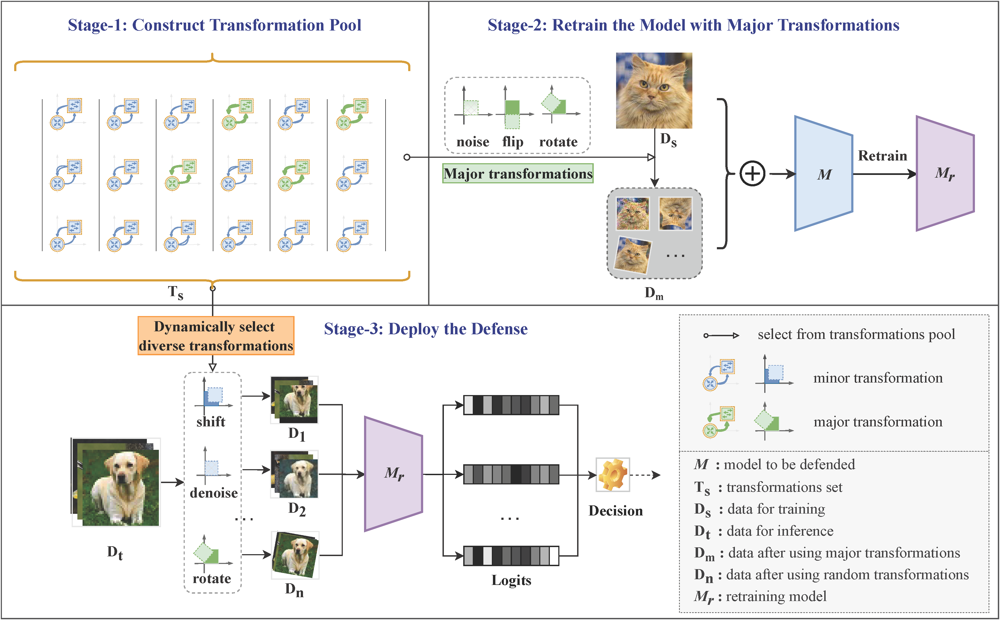

# DynamicDiverseTransformations
Code for paper "Dynamic and Diverse Transformations for Defending Against Adversarial Examples".

## Getting started

Let's start by installing all dependencies.

`pip install -r requirement.txt`

## Deploy the Defense

`python our_defense.py` 

