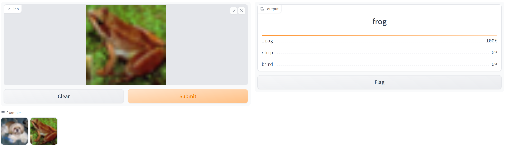

# DynamicDiverseTransformations
Code for paper "Dynamic and Diverse Transformations for Defending Against Adversarial Examples".

## Getting started

Let's start by installing all dependencies.

`pip install -r requirement.txt`

## Retrained Model

You can get the retrained model from [Baidu Netdisk](https://pan.baidu.com/s/1mcUOaV3_eq2A-H28Ubfffw?pwd=xkx5)

## Deploy the Defense

Run the defense using `python our_defense.py`, or check our defense in `our_defense.ipynb` file. 

